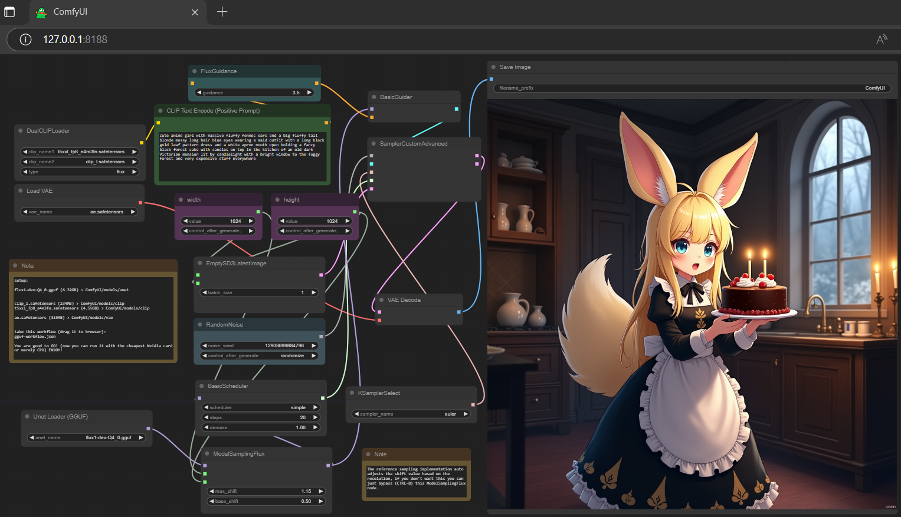

### gguf-comfy
GGUF node for ComfyUI

To work with this custom node: git clone this repository, replace your custom nodes folder (./ComfyUI/custom_nodes)
```
git clone https://github.com/calcuis/gguf-comfy
```
or you can get the compressed pack with mini-optimization (recommended for most of us) below (setup example)



Get the ComfyUI GGUF windows portable 7z:
### [Download Portal](https://github.com/calcuis/gguf-comfy/releases/download/0.3.4/ComfyUI_GGUF_windows_portable.7z)
- decompress the 7z bundle file: Extract All... (it includes everything you need to run a model)
- download [flux1-dev-Q4_0.gguf](https://huggingface.co/city96/FLUX.1-dev-gguf/blob/main/flux1-dev-Q4_0.gguf) (6.32GB); pull it to ./ComfyUI/models/unet
- download [clip_l.safetensors](https://huggingface.co/comfyanonymous/flux_text_encoders/blob/main/clip_l.safetensors) (234MB); pull it to ./ComfyUI/models/clip
- download [t5xxl_fp8_e4m3fn.safetensors](https://huggingface.co/comfyanonymous/flux_text_encoders/blob/main/t5xxl_fp8_e4m3fn.safetensors) (4.55GB); pull it to ./ComfyUI/models/clip
- download [ae.safetensors](https://huggingface.co/black-forest-labs/FLUX.1-schnell/blob/main/ae.safetensors) (319MB); pull it to ./ComfyUI/models/vae
- run the .bat file in the main directory (it will activate the py backend as well as the js frontend)
- drag [gguf-workflow.json](https://github.com/calcuis/gguf-comfy/blob/main/gguf-workflow.json) to the activated browser
#### Reference
[comfyanonymous](https://github.com/comfyanonymous/ComfyUI)
[city96](https://github.com/city96/ComfyUI-GGUF)
